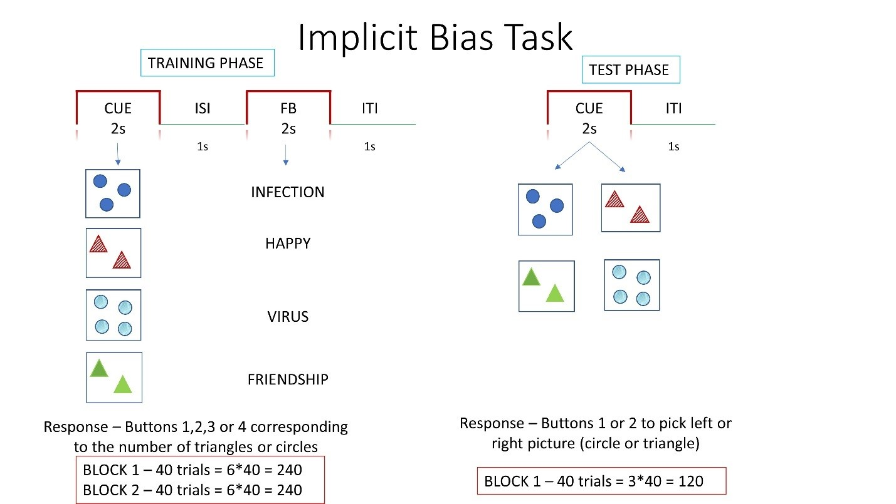

**Implicit Bias Task:** Subjects will be shown set of triangles or circles (different sizes, color) one at a time and subjects have to press buttons 1 to 4 depending on the number of triangles or circles presented. During block 1 of 40 trials, these are then followed by a positive or negative word at 80%-20% probability (e,g, triangles associated with 80% of positive words and circles negative words). At block 2, squares and stars will be presented and these are associated 50-50% with positive and negative words. During testing phase, randomly selected combination of triangles (80% positive) and squares (50% positive), and combination of circles (80% negative) and stars (50% negative), will be presented side-by-side for participants to choose the shape that they prefer. These are new stimuli and are not presented during training phase. This task is designed to test if they develop a bias towards positive or negatively associated shape implicitly.

